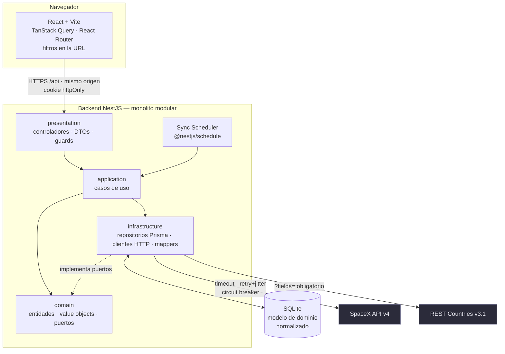
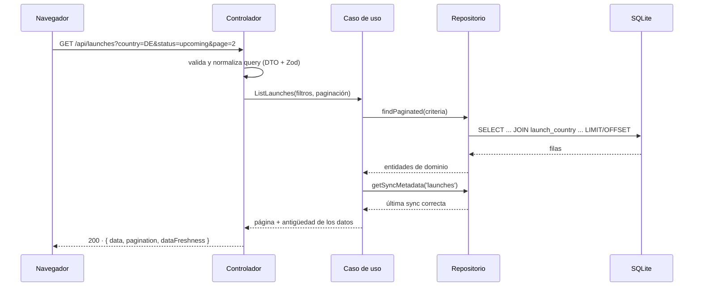
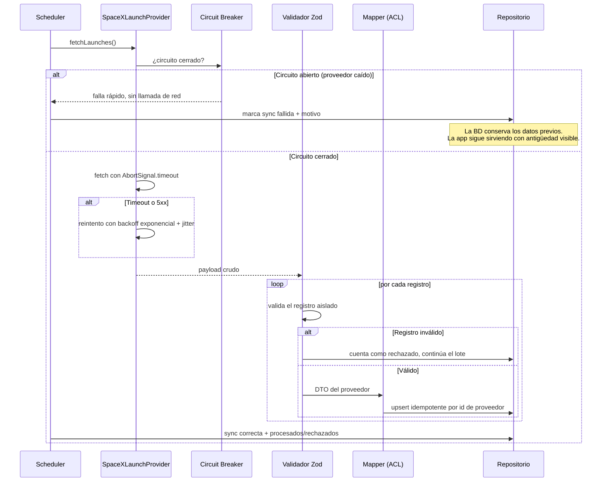
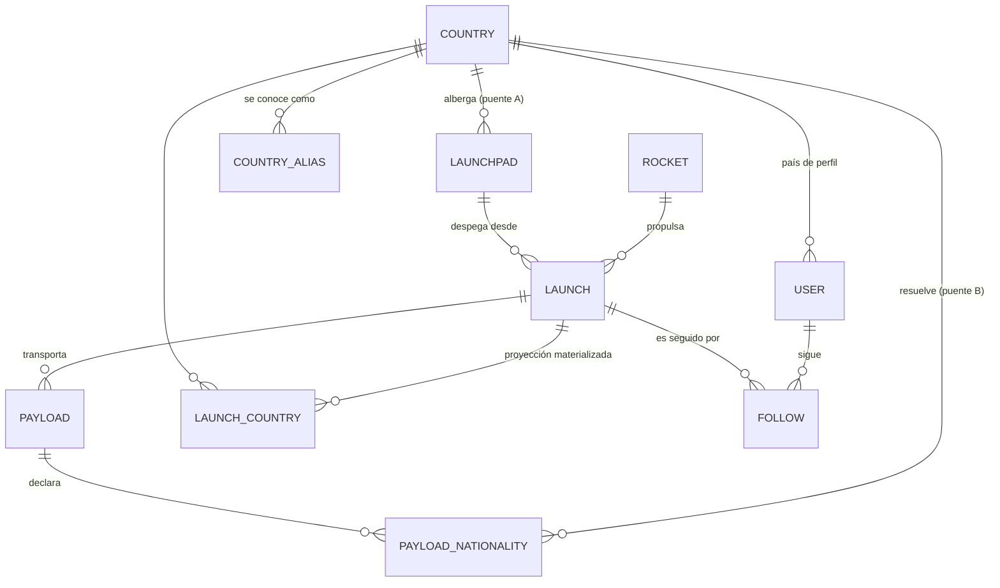

# Fase 3 — Arquitectura, modelo de dominio y rendimiento

Deriva de las decisiones cerradas en [Fase 2](./02-decisiones-tecnicas.md). Donde una
estructura existe por un ADR concreto, se cita.

---

## 1. Vista general



**La propiedad que define la arquitectura**: las flechas hacia SpaceX y REST Countries
salen **solo desde el planificador de sincronización**, nunca desde el camino de una
petición de usuario (ADR-005). El usuario siempre lee de SQLite. Esto es lo que hace
que la aplicación siga en pie con las fuentes caídas, y lo que la hace demostrable sin
red — condición no negociable en este entorno, donde ambas APIs están bloqueadas.

### Flujo 1 — Petición de usuario (el camino normal, sin red externa)



`dataFreshness` viaja en **cada** respuesta del catálogo. No es telemetría: es lo que
alimenta el indicador "datos de hace 3 h" de M9. La honestidad sobre la antigüedad es
parte del contrato de la API, no un detalle de la interfaz.

### Flujo 2 — Sincronización y degradación (el camino que casi nunca se prueba)



Tres decisiones visibles en este diagrama, todas deliberadas: el circuit breaker
**evita la llamada** en vez de esperarla, la validación es **por registro** (un
lanzamiento malformado no tumba el lote) y la escritura es **idempotente**, de modo que
un fallo a mitad de camino es seguro de reintentar.

---

## 2. Modelo de dominio



### Entidades

| Entidad | Papel | Campos que merecen explicación |
|---|---|---|
| **Launch** | Raíz de agregado del catálogo | `dateUtc` + `datePrecision` + `isTbd` forman un **value object indivisible** (§2.1). `success` es `null` mientras no ha volado — no `false`. `nameNormalized` es requisito funcional, no optimización (ADR-002) |
| **Rocket** | Vehículo | Referencia estable; cambia casi nunca |
| **Launchpad** | Sitio físico | `countryCode` es el **puente A**: no viene de la API, lo aporta un mapeo curado |
| **Payload** | Carga transportada | `customers[]` y `manufacturers[]` se guardan como JSON: son listas de texto libre sin identidad propia |
| **PayloadNationality** | **Entidad propia, no un array** | Aquí vive el puente B. Guarda `rawValue`, `resolvedCountryCode` (nullable), `resolutionStatus` y `resolutionMethod` |
| **Country** | Datos de REST Countries | PK `cca2`. `nameNormalized` para búsqueda sin acentos |
| **CountryAlias** | Sinónimos | Alimentada por `altSpellings` + tabla curada. Es lo que hace auditable la resolución |
| **LaunchCountry** | **Proyección materializada** | `(launchId, countryCode, relation)` con `relation ∈ {site, payload}`. Ver §3.1 |
| **User** | Cuenta | `emailNormalized` único. `passwordHash` Argon2id. `countryCode` nullable |
| **Follow** | El acto de seguir | PK compuesta `(userId, launchId)`: hace **imposible** un duplicado a nivel de esquema, en vez de comprobarlo en código |
| **SyncRun** | Bitácora de sincronización | Alimenta `dataFreshness` y hace la degradación observable |

### 2.1 `LaunchDate` — el value object que evita mentir

El fallo más fácil de este dominio es tratar `dateUtc` como un instante. La API entrega
`date_precision ∈ {hour, day, month, quarter, half, year}`: un lanzamiento con precisión
`month` tiene un `date_utc` que es un **marcador de posición**, no una hora real.
Renderizarlo como "3 feb 2026, 14:22" sería inventar información.

Por eso fecha y precisión viajan **siempre juntas** como un único value object, y el
formateo es una función total sobre él:

| Precisión | Se muestra | Cuenta atrás |
|---|---|---|
| `hour` | `3 feb 2026, 14:22 (tu hora local)` | Sí |
| `day` | `3 feb 2026 · hora por confirmar` | No |
| `month` | `Febrero 2026 · fecha por confirmar` | No |
| `quarter` / `half` | `1T 2026` / `1S 2026 · estimado` | No |
| `year` | `2026 · sin fecha asignada` | No |
| `isTbd` | Prefijo `Provisional:` sobre cualquiera | No |

Que sea un tipo del dominio y no un helper de presentación tiene una consecuencia
práctica: **es imposible pasar la fecha por la UI sin su precisión**, porque el tipo no
lo permite. La corrección deja de depender de que nadie se despiste.

### 2.2 Estado del lanzamiento — derivado, no confiado (riesgo R3)

SpaceX v4 expone un flag `upcoming` que, por el estado de mantenimiento de la fuente,
puede contradecir la fecha (lanzamientos marcados como próximos que ya ocurrieron). El
dominio calcula:

```
upcoming   : dateUtc > now  ∧  success = null
launched   : dateUtc ≤ now  ∧  success ≠ null
stale_flag : upcoming = true ∧ dateUtc < now   → se marca y se reporta
```

Un `stale_flag` no se oculta: se cuenta y se expone como incidencia de calidad de
datos, igual que las nacionalidades no resueltas. **La fuente puede estar mal; la
aplicación no puede fingir que no lo sabe.**

### 2.3 Resolución de país — cadena explícita y auditable

Orden de intento para cada `nationalities[]`, deteniéndose en el primer acierto:

1. Coincidencia exacta con `name.common` normalizado
2. Coincidencia exacta con `name.official` normalizado
3. Coincidencia en `altSpellings` (de REST Countries)
4. Tabla de alias curada del repositorio (`"Republic of Korea"` → `KR`)
5. Lista de **no-países** conocidos (`"European Union"`) → `not_a_country`
6. Sin acierto → `unresolved`

`resolutionMethod` guarda **cuál de los seis pasos** resolvió cada caso. Eso convierte
la vista de calidad de datos en algo accionable: no dice solo "85 % resuelto", dice qué
falta y por qué. Nunca hay coincidencia difusa ni por proximidad: preferimos un
`unresolved` visible a un país inventado (ADR-006).

---

## 3. Estrategia de rendimiento

El cuello de botella de este sistema **no es la CPU ni el volumen de datos** (S9:
decenas de usuarios, ~5-10 k filas). Son dos cosas: la latencia de terceros —ya
eliminada del camino de usuario por ADR-005— y las consultas que se degradan al cruzar
lanzamientos con países. El resto es no estropear lo que ya es rápido.

### 3.1 Materializar la proyección país↔lanzamiento en tiempo de escritura

"Lanzamientos relacionados con Alemania" recorre dos caminos distintos: por sitio
(`Launch → Launchpad → Country`) y por carga
(`Launch → Payload → PayloadNationality → Country`). El segundo es un join de tres
saltos que además hay que deduplicar y unir con el primero — en cada petición, en cada
página, para cada filtro.

**Decisión: se calcula una vez al sincronizar, no en cada lectura.** La tabla
`LaunchCountry(launchId, countryCode, relation)` se recompone al final de cada sync, y
toda consulta por país pasa a ser **un único join sobre índice**.

Es una desnormalización deliberada, y las condiciones que la hacen segura están dadas:
el catálogo es de solo lectura para los usuarios (S11), **el sincronizador es el único
escritor**, y las lecturas superan a las escrituras en varios órdenes de magnitud. No
hay riesgo de divergencia por escrituras concurrentes porque no existen escrituras
concurrentes. Sin esas condiciones sería una mala idea; con ellas, es la correcta.

### 3.2 Índices, y por qué cada uno

| Índice | Consulta que sirve |
|---|---|
| `Launch(dateUtc)` | Orden por defecto del catálogo y corte próximos/pasados |
| `Launch(nameNormalized)` | Búsqueda por nombre de misión |
| `LaunchCountry(countryCode, launchId)` | Vista de país (§3.1) |
| `Follow(userId)` | Panel "Mis misiones" |
| `Payload(launchId)` | Composición del detalle |
| `User(emailNormalized)` UNIQUE | Login e integridad de cuentas |

Nada de "indexar por si acaso": cada índice tiene una consulta concreta detrás, y su
coste en escritura lo paga el sincronizador, no el usuario.

### 3.3 Paginación

**Offset con tope duro de tamaño de página** (por defecto 20, máximo 100, validado en
el DTO). A esta escala el coste de `OFFSET` es irrelevante, y el catálogo necesita
total de resultados y salto a página concreta, que la paginación por cursor no da
gratis.

Es un compromiso, y se documenta como tal: si el catálogo creciera un par de órdenes de
magnitud, la vía es paginación por keyset sobre `(dateUtc, id)`. **Migrar entonces es
barato; hacerlo ahora sería optimizar sin medida.**

### 3.4 Evitar llamadas redundantes, en las tres capas

- **Contra terceros** (ADR-005): sincronización en servidor y no por usuario; cadencias
  diferenciadas (próximos 15 min · históricos 24 h · países 30 días); circuit breaker
  que evita la llamada cuando el proveedor está caído; concurrencia limitada.
- **Contra la base de datos**: los repositorios devuelven **DTO ya compuestos** con
  `include` + `select` proyectado. El controlador nunca dispara consultas por elemento
  de una lista — el clásico N+1 se evita por diseño de la capa, no por vigilancia.
- **Contra el propio backend**: `ETag` + `Cache-Control` en los endpoints de catálogo
  (son datos compartidos y de baja volatilidad), con `staleTime` de TanStack Query
  alineado a la cadencia de sync. No tiene sentido refrescar cada 30 s un recurso que
  cambia cada 15 min.

### 3.5 Frontend

- **Code splitting por ruta** con `React.lazy`: la vista de detalle y el panel privado
  no lastran la carga inicial del catálogo, que es la única página que ve un visitante
  que llega por primera vez.
- **`loading="lazy"` en parches y banderas**, más `width`/`height` fijos para que no
  haya salto de layout (CLS) al cargar imágenes de terceros.
- **Fallback de imagen** obligatorio (riesgo R7): un parche que ya no existe muestra un
  marcador propio con `alt` correcto, nunca el icono roto del navegador.
- **Estado de servidor cacheado y compartido** por TanStack Query: navegar al detalle y
  volver no re-consulta el catálogo.
- **Cuenta atrás con un único intervalo** en el nivel del panel, no un `setInterval` por
  tarjeta.

### 3.6 Lo que NO se hace, y por qué

- **Sin Redis ni caché distribuida.** Con SQLite local y datos ya materializados,
  añadir un servicio más contradiría ADR-008 (instalación sin servidores) a cambio de
  microsegundos que nadie percibe.
- **Sin virtualización de listas.** Con páginas de 20 elementos no hay nada que
  virtualizar. Entraría solo si se adopta scroll infinito.
- **Sin SSR.** Añade complejidad de despliegue real; el SEO no es un objetivo declarado
  del MVP. Queda en el roadmap si el descubrimiento orgánico pasa a importar.

---

## 4. Estructura de carpetas

```
space-launch-tracker/
├── .nvmrc                        Node 22
├── package.json                  workspaces + scripts raíz (dev, setup, test)
├── apps/
│   ├── api/
│   │   ├── prisma/
│   │   │   ├── schema.prisma     modelo de dominio (§2)
│   │   │   ├── migrations/
│   │   │   └── seed.ts           siembra desde fixtures
│   │   ├── prisma.config.ts      exigido por Prisma 7 (ADR-002)
│   │   ├── fixtures/             capturas de SpaceX v4 y REST Countries v3.1
│   │   └── src/
│   │       ├── launches/
│   │       │   ├── domain/       Launch, LaunchDate, LaunchStatus, puertos
│   │       │   ├── application/  casos de uso
│   │       │   ├── infrastructure/ repositorio Prisma, cliente SpaceX, mappers
│   │       │   └── presentation/ controlador + DTOs
│   │       ├── countries/        misma estructura · resolución de país
│   │       ├── follows/          misma estructura
│   │       ├── auth/             registro, login, guard JWT
│   │       ├── sync/             scheduler, circuit breaker, bitácora
│   │       └── shared/           errores de dominio, resiliencia HTTP, filtros
│   └── web/
│       └── src/
│           ├── features/         launches · countries · follows · auth
│           ├── components/       primitivos de UI reutilizables
│           ├── styles/           tokens.css + CSS Modules (ADR-003)
│           └── lib/              cliente HTTP, formateo de fechas, copy
└── packages/shared/              tipos del contrato HTTP (fuente única de verdad)
```

Cada módulo de `api/src` repite las cuatro capas de ADR-007. La repetición es
intencionada: **la estructura enseña la regla**, y quien añada un módulo nuevo tiene el
patrón delante sin necesidad de leer documentación.

---

## 5. Contrato HTTP

| Método | Ruta | Auth | Devuelve |
|---|---|---|---|
| `GET` | `/api/launches` | — | Página de lanzamientos + `dataFreshness` |
| `GET` | `/api/launches/:id` | — | Detalle compuesto (cohete, sitio, cargas, países) |
| `GET` | `/api/countries` | — | Directorio con recuento de lanzamientos |
| `GET` | `/api/countries/:cca2` | — | País + lanzamientos por sitio y por carga |
| `GET` | `/api/data-quality` | — | Cobertura de resolución, no resueltos, flags obsoletos |
| `POST` | `/api/auth/register` | — | Sesión (cookie httpOnly) |
| `POST` | `/api/auth/login` | — | Sesión |
| `POST` | `/api/auth/logout` | ✔ | — |
| `GET` | `/api/auth/me` | ✔ | Usuario actual |
| `GET` | `/api/follows` | ✔ | Misiones seguidas, ordenadas por proximidad |
| `PUT` | `/api/follows/:launchId` | ✔ | Seguir (idempotente) |
| `DELETE` | `/api/follows/:launchId` | ✔ | Dejar de seguir (idempotente) |

Dos elecciones conscientes: `/api/follows` usa **`PUT`/`DELETE` idempotentes** en vez de
`POST /follow` — pulsar dos veces no puede crear un estado inconsistente. Y **ninguna
ruta acepta `userId`**: siempre se deriva del token (ADR-004), lo que elimina por
construcción el fallo de seguir misiones en nombre de otro.

`GET /api/data-quality` existe porque el compromiso de Fase 1 era que los datos no
resueltos fueran **visibles en la interfaz**, no enterrados en un log. Sin endpoint no
hay pantalla.

---

## 6. Errores: un vocabulario, no `try/catch` dispersos

Los errores de dominio son tipos propios, y un `ExceptionFilter` global de Nest los
traduce a HTTP en un único sitio. Ninguna capa interna sabe qué es un código de estado.

| Error de dominio | HTTP | Mensaje al usuario |
|---|---|---|
| `LaunchNotFound` | 404 | "Esa misión no está en el catálogo" |
| `AlreadyFollowing` | 200 | *(idempotente: no es un error)* |
| `InvalidCredentials` | 401 | "Email o contraseña incorrectos" — sin revelar cuál |
| `EmailAlreadyRegistered` | 409 | "Ya existe una cuenta con ese email" |
| `ExternalProviderUnavailable` | *no llega al usuario* | Se sirve caché con antigüedad |
| `SyncFailed` | *no llega al usuario* | Queda en `SyncRun` y en `/api/data-quality` |

Los dos últimos son el corazón de M9: **un fallo de terceros no es un error de la
petición del usuario**, porque su petición se resuelve igual contra la base de datos.
Convertir una caída de SpaceX en un 500 sería propagar al usuario un problema que la
arquitectura ya absorbió.

---

## 7. Definition of Done de la Fase 3

- [x] Diagrama general + flujo normal + flujo degradado
- [x] Modelo de dominio con 11 entidades y sus relaciones
- [x] `LaunchDate` como value object que impide mostrar fechas falsas
- [x] Estado derivado en vez de confiado (riesgo R3)
- [x] Cadena de resolución de país auditable en 6 pasos
- [x] Rendimiento: materialización, índices justificados, paginación, N+1, frontend
- [x] Estructura de carpetas, contrato HTTP y vocabulario de errores
